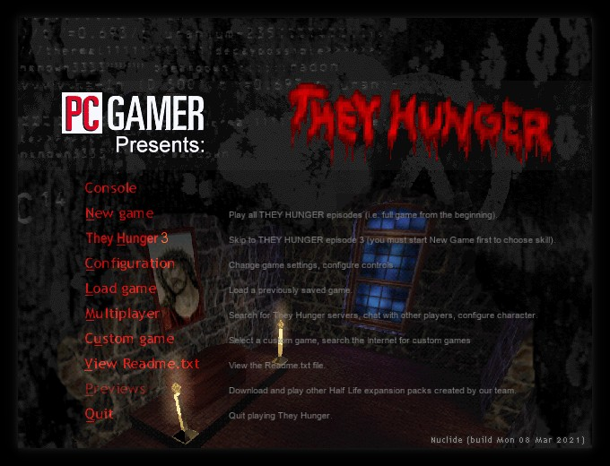
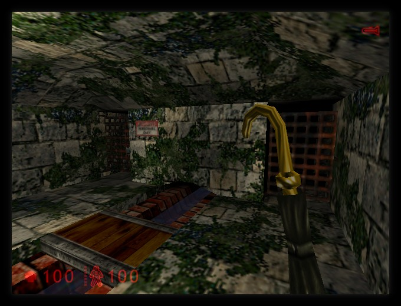
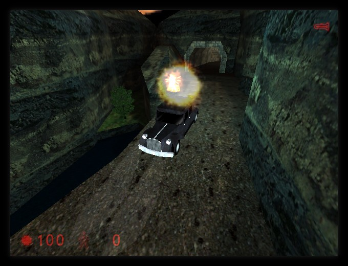
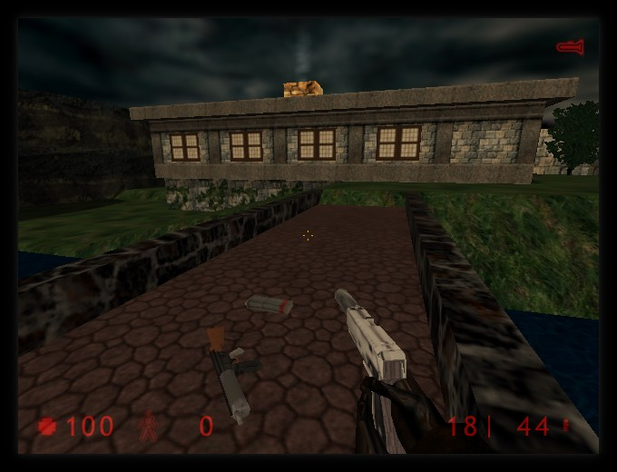

# FreeHunger (AKA Still Hungry)
Clean-room reimplementation of They Hunger in QuakeC.

## Building
Clone the repository into the Nuclide-SDK:

> git clone REPOURL hunger

then either run Nuclide's ./build_game.sh shell script, or issue 'make' inside
./hunger/src!

Obviously make sure that Nuclide has fteqw and fteqcc set-up for building.

## Status / Changes

So far all the weapons are re-implemented, but SP hasn't been worked on yet, so
no custom NPC skins or behavior.

Multiplayer is functional, and now has some unique CVARs to give it more of a
personality and make it fit in more with They Hunger's world:

- Changed weapon placement for THDM
  Included are .ent files that have changed the weapons placed in the default
  DM maps for They Hunger. Replacing most Half-Life weapons with TH counter-parts.

- th_medkitstyle 0/1 (default 0)
  All medkit pickups turn into the medkit weapon from SP, and each pickup is one
  ammo (or shot) that needs to be administered for health.

- th_shovelstyle 0/1 (default 0)
  Gives the shovel visual first person effects, and slows down its attack.

- th_rpgstyle 0/1 (default 0)
  Removes the homing secondary toggle making it similar to a real RPG.

You can enable these new CVARs with "exec mp_enhanced.cfg" in console.

## Community

### Matrix
If you're a fellow Matrix user, join the Nuclide Space to see live-updates and more!
https://matrix.to/#/#nuclide:matrix.org

### IRC
Join us on #freecs via irc.libera.chat and talk/lurk or discuss bugs, issues
and other such things. It's bridged with the Matrix room of the same name!

### Others
We've had people ask in the oddest of places for help, please don't do that.

## License
ISC License

Copyright (c) 2016-2022 Marco Cawthorne <marco@icculus.org>

Copyright (c) 2019-2022 Gethyn ThomasQuail <xylemon@posteo.net>

Permission to use, copy, modify, and distribute this software for any
purpose with or without fee is hereby granted, provided that the above
copyright notice and this permission notice appear in all copies.

THE SOFTWARE IS PROVIDED "AS IS" AND THE AUTHOR DISCLAIMS ALL WARRANTIES
WITH REGARD TO THIS SOFTWARE INCLUDING ALL IMPLIED WARRANTIES OF
MERCHANTABILITY AND FITNESS. IN NO EVENT SHALL THE AUTHOR BE LIABLE FOR
ANY SPECIAL, DIRECT, INDIRECT, OR CONSEQUENTIAL DAMAGES OR ANY DAMAGES
WHATSOEVER RESULTING FROM LOSS OF MIND, USE, DATA OR PROFITS, WHETHER
IN AN ACTION OF CONTRACT, NEGLIGENCE OR OTHER TORTIOUS ACTION, ARISING
OUT OF OR IN CONNECTION WITH THE USE OR PERFORMANCE OF THIS SOFTWARE.
